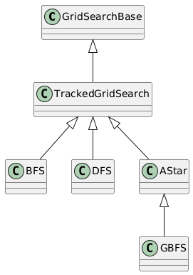
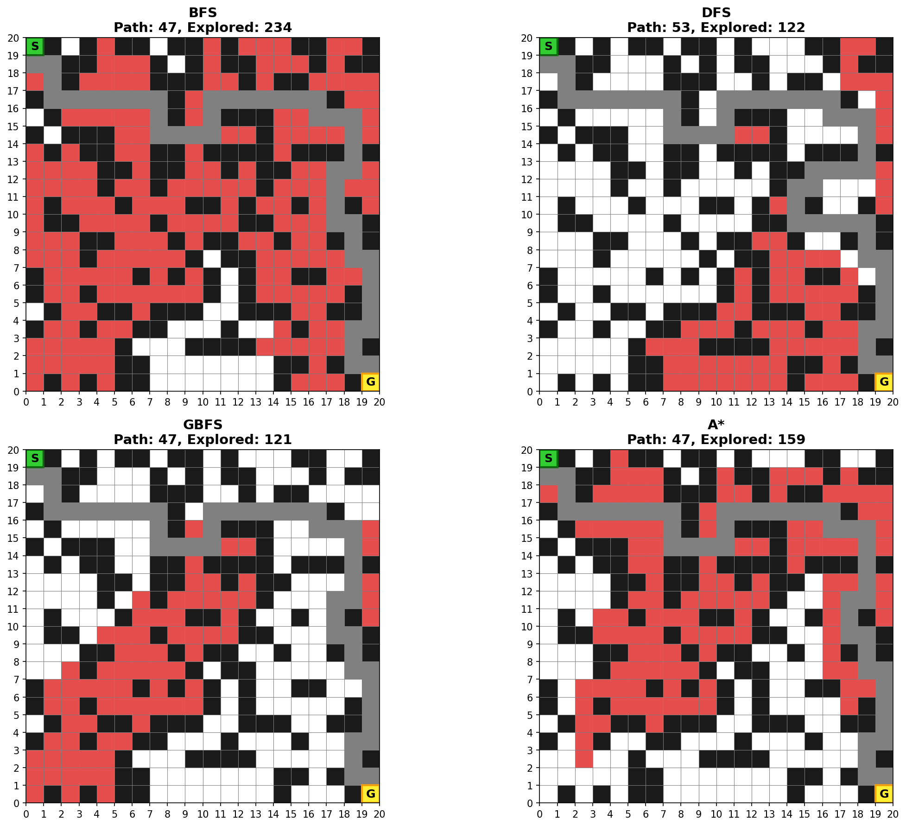

# Robot Maze Path Planning - AI Search Algorithms

A Python-based project implementing DFS, BFS, Greedy Best-First Search, and A* for robot path planning in a grid maze. Visualizes exploration and final path using color-coded grids and compares performance across search methods.

## Features

- **Four Search Algorithms:**
  - **BFS (Breadth-First Search)** - Guarantees shortest path, explores level by level
  - **DFS (Depth-First Search)** - Explores depth-first, does not guarantee shortest path
  - **GBFS (Greedy Best-First Search)** - Uses heuristic only, f(n) = h(n)
  - **A\* (A-Star Search)** - Optimal search, f(n) = g(n) + h(n)

- **Visualization:**
  - Step-by-step animations showing exploration progress
  - Color-coded cells:
    - **GREEN** - Start cell
    -  **YELLOW** - Goal cell
    - **RED** - Explored/visited cells
    - **BLUE** - Frontier cells (to be explored)
    - **GREY** - Final path
    - **BLACK** - Walls

- **Maze Generation:**
  - Random solvable maze generation with configurable dimensions
  - BFS-validated paths to ensure solvability
  - Fallback maze for consistency

## Installation

```bash
# Clone the repository
git clone https://github.com/abebeana/robot-maze-path-planning-ai-search.git
cd robot-maze-path-planning-ai-search

# Install dependencies
pip install numpy matplotlib pillow
```

## Usage

### Using Make (Recommended)

```bash
# Run with fallback maze and generate animations
make all

# Run with fallback maze only
make run-fallback

# Run with randomly generated maze
make run

# Generate animations
make animate

# Run with 20x20 maze
make run-large

# Run with dense walls (0.4 probability)
make run-dense

# Run with seed for reproducibility
make run-seeded

# Clean generated files
make clean

# Show all available commands
make help
```

### Custom Configuration

Pass environment variables to customize behavior:

```bash
# Custom maze size
make run MAZE_ROWS=15 MAZE_COLS=20

# Custom wall probability with animations
make run WALL_PROB=0.4 SAVE_ANIMATIONS=1

# Use specific Python interpreter
make run-fallback PYTHON=/path/to/python
```

### Environment Variables

| Variable | Default | Description |
|----------|---------|-------------|
| `MAZE_ROWS` | 10 | Number of rows |
| `MAZE_COLS` | 15 | Number of columns |
| `WALL_PROB` | 0.3 | Wall probability (0.0-1.0) |
| `SAVE_ANIMATIONS` | 0 | Set to 1 to save GIF animations |
| `USE_FALLBACK` | 0 | Set to 1 to use fallback maze |
| `RANDOM_SEED` | - | Random seed for reproducibility |
| `OUTPUT_DIR` | ../results | Output directory |

### Using as a Library

```python
from search_algorithms import bfs_search, dfs_search, gbfs_search, astar_search
from search_algorithms import generate_maze
from visualization import animate_search

# Generate a solvable maze
grid = generate_maze(10, 15, wall_prob=0.3)
start = (0, 0)
goal = (9, 14)

# Run BFS
result = bfs_search(grid, start, goal)
print(f"Path length: {result.path_length}")
print(f"Cells explored: {result.explored_count}")

# Create animation
animate_search(grid, start, goal, result, "BFS", filename="bfs_animation.gif")
```

## Project Structure

```
robot-maze-path-planning-ai-search/
├── README.md
├── Makefile
│
├── code/
│   ├── main.py
│   ├── search_algorithms/
│   │   ├── __init__.py
│   │   ├── utils.py
│   │   ├── bfs.py
│   │   ├── dfs.py
│   │   ├── gbfs.py
│   │   ├── astar.py
│   │   └── maze.py
│   └── visualization/
│       ├── __init__.py
│       ├── colors.py
│       ├── draw_grid.py
│       └── animate_search.py
│
├── res/
│   └── inheritance.png
│
└── results/
    ├── bfs_path.txt
    ├── dfs_path.txt
    ├── gbfs_path.txt
    ├── astar_path.txt
    ├── performance_metrics.csv
    ├── algorithm_comparison.png
    └── animations/
        ├── bfs_animation.gif
        ├── dfs_animation.gif
        ├── gbfs_animation.gif
        └── astar_animation.gif
```

## Class Hierarchy



## Algorithm Comparison



## Output

The program generates:
- **Console output:** ASCII maze, algorithm comparison table
- **Path files:** `[algorithm]_path.txt` with path coordinates
- **Metrics:** `performance_metrics.csv` with comparison data
- **Comparison image:** `algorithm_comparison.png`
- **Animations (optional):** `[algorithm]_animation.gif`

## Dependencies

- Python 3.7+
- NumPy
- Matplotlib
- Pillow (for GIF generation)

